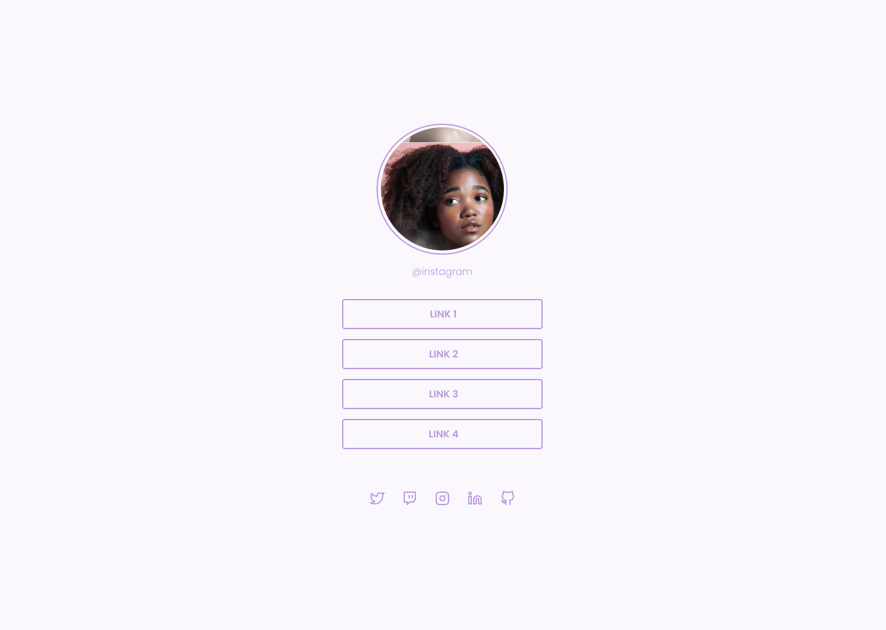

## 🛡️| Desafio Social Tree

[🔗 Clique aqui para acessar o figma](https://www.figma.com/file/4uikFH0k8XqKuMyNt7nXX2/DD-%2F-Social-links-(Copy)?node-id=120%3A19)
> Discover
#
[🔗 Clique aqui para acessar o projeto](https://bortoli.vercel.app/)
#
Projeto da trilha Discover da Rocketseat, obviamente fiz algumas alterações para minhas necessidades porém a base do projeto é a mesma.
#
## 📲 | CONTATO

 
  
  
  

